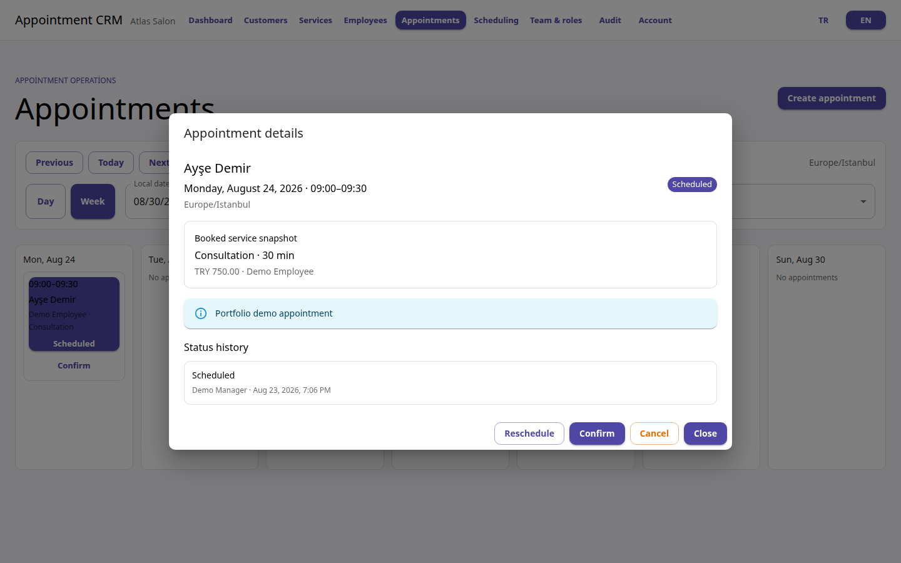
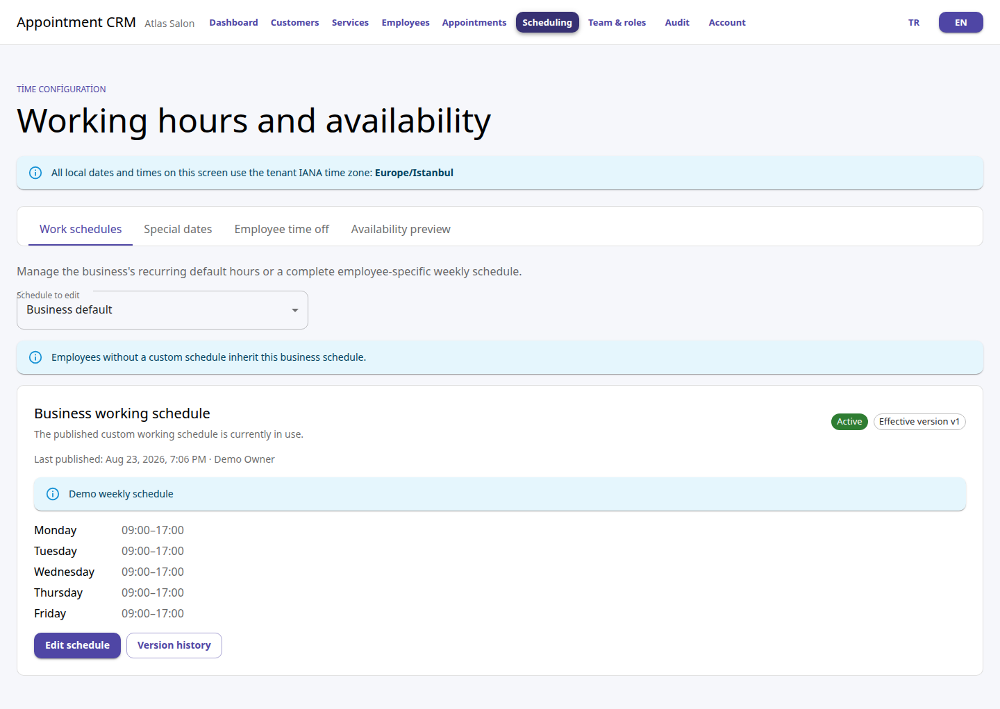
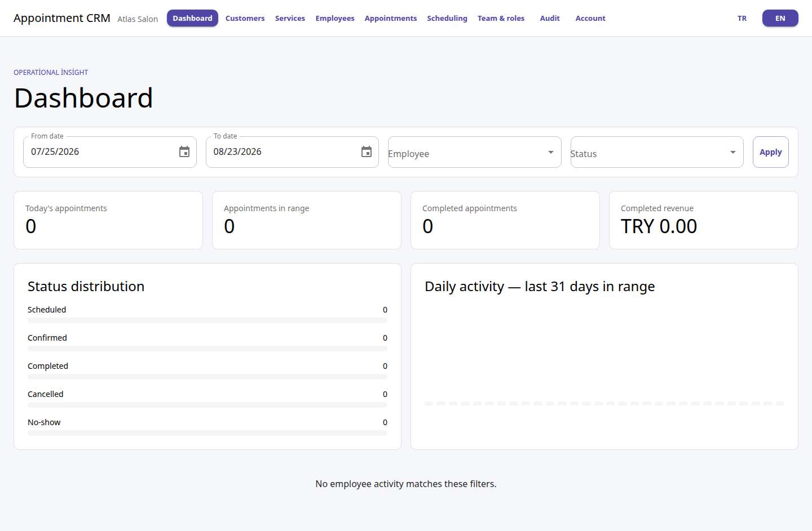

# Appointment CRM

A multi-tenant appointment CRM for teams that manage customers, services, employees, schedules, and appointments from one workspace.

> The application is ready to run locally. A public demo link will be added after the hosting environment is available.

## What it solves

Appointment-based businesses need more than a calendar. They must keep tenant data separate, prevent double booking, apply working-hour rules in the correct time zone, and preserve a clear history of important changes.

Appointment CRM provides these controls in one application:

- customer, service, employee, and team management;
- day and week appointment views;
- availability based on working hours, date overrides, and time off;
- appointment confirmation, completion, cancellation, no-show, and rescheduling;
- dashboard reporting and audit history;
- role-based access for owner, manager, receptionist, and employee users.

## Technical highlights

- Tenant isolation is enforced by request context, EF Core query filters, write guards, tenant-scoped keys, and integration tests.
- PostgreSQL prevents overlapping appointments. A tenant/employee advisory lock keeps concurrent writes orderly, while an exclusion constraint remains the final authority.
- Access tokens are short lived. Refresh tokens are single use, rotated, hashed in the database, and sent in an `HttpOnly` cookie.
- Appointment changes, audit entries, history, and outbox messages are committed in the same transaction.
- Redis stores only replaceable dashboard data. PostgreSQL remains the source of truth when Redis is unavailable.
- The release pipeline builds non-root `amd64` and `arm64` images and promotes their scanned multi-architecture manifests by immutable digest after quality, migration, and smoke gates pass.

See the [architecture overview](docs/architecture/overview.md), [tenant isolation](docs/architecture/tenant-isolation.md), and [appointment concurrency](docs/architecture/appointment-concurrency.md) for the main design decisions.

## Screenshots

| Appointment detail                                                          | Working schedule                                                             |
| --------------------------------------------------------------------------- | ---------------------------------------------------------------------------- |
|  |  |



Watch the extended local product tour in [English](docs/assets/appointment-crm-demo-en.webm) or [Turkish](docs/assets/appointment-crm-demo-tr.webm). All visible data is disposable sample data. Screenshots use the English interface.

## Quick start

Requirements:

- Docker Desktop or Docker Engine with Compose v2

Start the full local stack:

```text
docker compose up --build --detach --wait --wait-timeout 120
```

Open <http://localhost:5173>. The command builds and starts PostgreSQL, Redis, the migration job, API, and web application. It also waits for API readiness.

Stop the stack without deleting the database volume:

```text
docker compose down
```

The local environment seeds two sample tenants. The default development-only password is `Demo-local-2026!`.

| Account                   | Role         | Workspace                            |
| ------------------------- | ------------ | ------------------------------------ |
| `owner@demo.local`        | Owner        | Atlas Salon and Northwind Consulting |
| `manager@demo.local`      | Manager      | Atlas Salon                          |
| `receptionist@demo.local` | Receptionist | Atlas Salon                          |
| `employee@demo.local`     | Employee     | Atlas Salon                          |
| `north.owner@demo.local`  | Owner        | Northwind Consulting                 |

These credentials are only for an isolated local machine. Public and production environments use different secret and demo-account rules.

Useful endpoints:

- Application: <http://localhost:5173>
- Readiness: <http://localhost:5173/health/ready>
- OpenAPI document: <http://localhost:5173/openapi/v1.json>
- Direct API: <http://localhost:8080>

For native development, migrations, common problems, and debugging, see [local development](docs/operations/local-development.md).

The local Compose workflow supports Linux, macOS with Docker Desktop, and Windows with Docker Desktop using Linux containers. Production deployment intentionally targets Linux hosts.

## Architecture

The backend is a modular monolith split into Domain, Application, Infrastructure, Contracts, and API projects. The React application uses vertical feature folders and keeps route pages small.

```text
Browser -> Web/Nginx -> ASP.NET Core API -> PostgreSQL
                              |
                              +-------------> Redis (optional cache)
                              |
                              +-------------> Outbox worker -> Notification provider
```

The full context, container, and module diagrams are in the [architecture overview](docs/architecture/overview.md).

## Quality checks

Native verification requires .NET 10, Node.js 22, npm, Docker, and Compose:

```text
node scripts/verify.mjs
```

The quality gate covers:

- formatting and warning-free release builds;
- unit and PostgreSQL/Redis integration tests;
- authorization and tenant-isolation matrices;
- concurrent appointment writes and transaction rollback;
- empty and upgrade migration paths;
- frontend lint, type, unit, E2E, keyboard, responsive, and accessibility checks;
- dependency, runtime image, readiness, and authenticated container smoke checks.

The current evidence includes 172 backend unit tests, 64 backend integration tests, and 77 frontend tests. Eight concurrent requests for the same slot produce exactly one appointment and seven conflicts.

## Deployment

The repository contains staging and production deployment contracts, TLS ingress, external-secret boundaries, encrypted backup/restore tools, public-demo reset automation, and digest-based release promotion. No public hostname is published yet.

- [Deployment](docs/operations/deployment.md)
- [Database releases](docs/operations/database-release.md)
- [Backup and restore](docs/operations/backup-restore.md)
- [Public demo operations](docs/operations/public-demo.md)
- [Release checklist](RELEASE_CHECKLIST.md)
- [Draft release notes](RELEASE_NOTES.md)

## Scope

This release focuses on an internal appointment CRM. Public self-booking, payments, real email/SMS delivery, subscriptions, and a mobile application are not included. See [known limitations](KNOWN_LIMITATIONS.md) for the complete boundary.

## Case study

The [case study](docs/case-study.md) explains the problem, constraints, design choices, alternatives, and measured results without requiring a code-level review.

## License

Copyright © 2026 Ali Akıncı. Licensed under the [MIT License](LICENSE).
