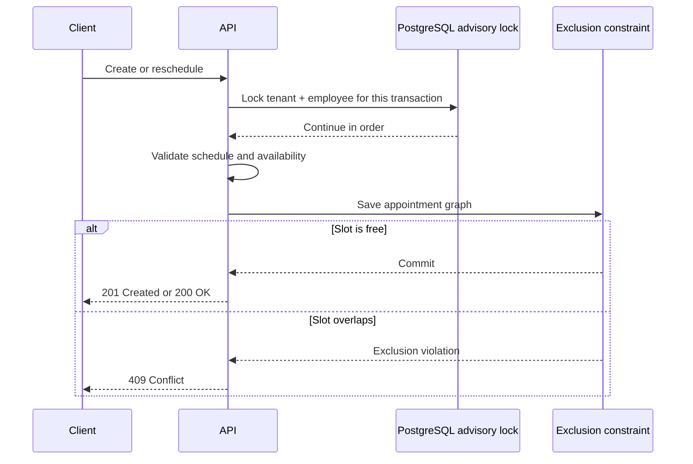

# Appointment concurrency

## The risk

Two users can select the same employee and time before either request finishes. A normal “check availability, then insert” flow can allow both requests to pass.

The rule is simple: one employee cannot have overlapping active appointments inside the same tenant.

## Write flow

The transaction-scoped advisory lock reduces deadlocks and makes writes for the same tenant/employee run in order. The PostgreSQL GiST exclusion constraint remains the final correctness rule.

The database range uses `[start, end)`. An appointment ending at 10:00 does not conflict with another starting at 10:00.

## Why both controls exist

- An application-only check has a race window.
- A constraint-only solution protects the data but can create avoidable deadlock/retry pressure under a burst of identical requests.
- A process-local lock fails when more than one API instance is running.
- A broad database lock would reduce throughput for unrelated employees.

The chosen lock key contains both tenant and employee IDs. Requests for different employees can still proceed independently.

## Transaction boundary

A successful write commits the appointment, status history, audit entry, and outbox message together. A conflict rolls the whole transaction back and becomes a stable `409` problem response.

## Evidence

- [`AppointmentService`](../../src/server/AppointmentCrm.Infrastructure/Appointments/AppointmentService.cs) owns the transaction, advisory lock, and conflict mapping.
- [`AppointmentLifecycle` migration](../../src/server/AppointmentCrm.Infrastructure/Persistence/Migrations/20260823001133_AppointmentLifecycle.cs) creates the exclusion constraint.
- [`ReleaseQualityGateTests`](../../tests/AppointmentCrm.IntegrationTests/ReleaseQualityGateTests.cs) sends eight parallel requests for one slot. The result is exactly one `201`, seven `409` responses, and one appointment/history/audit/outbox graph.

This design assumes PostgreSQL is the source of truth. Redis is never used to decide whether a slot is free.
