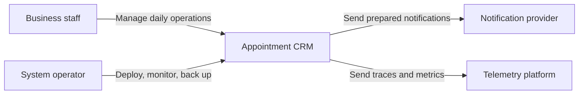
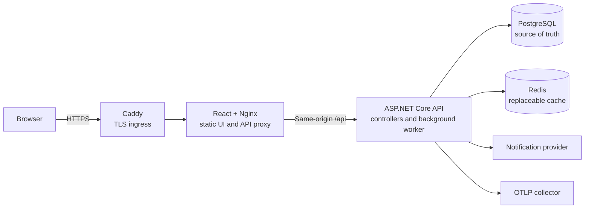
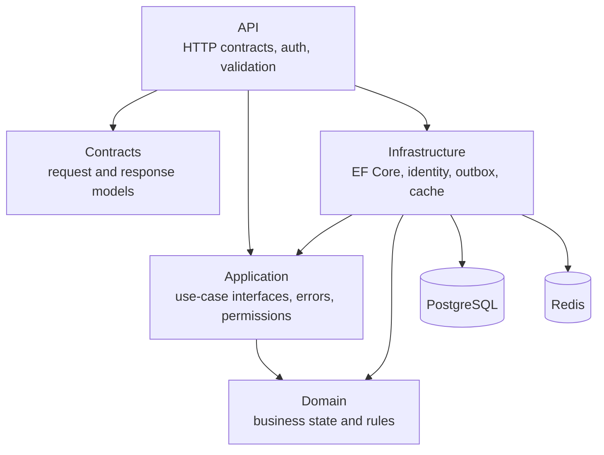
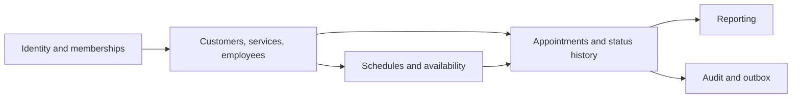

# Architecture overview

Appointment CRM is a modular monolith. It keeps one deployable backend while giving each business area a clear boundary.

## System context

Business staff use one tenant workspace. The active tenant and permissions are part of the authenticated session. Operators manage deployment and recovery without using business endpoints.

## Containers

Only Caddy is public in the release deployment. PostgreSQL, Redis, Nginx, and the API remain on private container networks.

Redis is optional for correctness. If it is unavailable, reporting reads from PostgreSQL.

## Backend modules

- **Domain** owns business state and valid state changes.
- **Application** defines use cases, permissions, stable errors, and service contracts.
- **Infrastructure** implements persistence, identity, reporting cache, and outbox delivery.
- **Contracts** contains the public HTTP request and response shapes.
- **API** contains controllers and cross-cutting HTTP behavior.

The frontend follows the same business areas under `src/web/src/features`. Route pages only connect a URL to a feature entry point.

## Main domain areas

The arrows show data dependency, not separate network services. A single database transaction can therefore update an appointment, its history, audit entry, and outbox message together.

## Important boundaries

- [Tenant isolation](tenant-isolation.md)
- [Appointment concurrency](appointment-concurrency.md)
- [Known limitations](../../KNOWN_LIMITATIONS.md)
- [Deployment](../operations/deployment.md)
